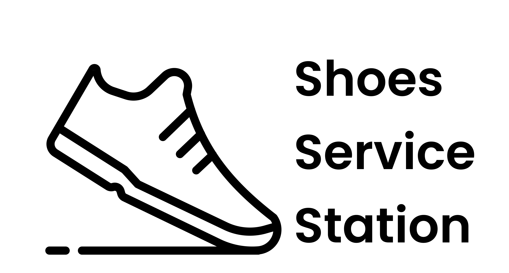

<div align="center">

<h1>Welcome to Shoes Service Station👋</h1>


<!-- PROJECT LOGO -->


</div>

## 📝 About the Project

Nowadays, some people are very busy and don't even have time to clean their shoes. Therefore we need a platform that is able to connect customers with shoes washing service provider.

## 🌐 DEMO (Deployment)

- [Netlify](https://shoes-service-station.netlify.app/)

<p align="right">(<a href="#top">back to top</a>)</p>

## 🎨 Prototype Figma

- [User](https://www.figma.com/proto/bSG0AWlCKrcXoG98z7lTyN/Shoes-Service-Station?node-id=435%3A385&starting-point-node-id=435%3A385&scaling=scale-down)
- [Admin](https://www.figma.com/proto/bSG0AWlCKrcXoG98z7lTyN/Shoes-Service-Station?node-id=435%3A385&starting-point-node-id=435%3A385&scaling=scale-down)

<p align="right">(<a href="#top">back to top</a>)</p>

## 🤝 Collaboration

- [Trello (Work Management Tool)](https://trello.com/)
- [GitHub (Version Control System Platform)](https://github.com/alta-shoes-and-care/)

### ⚙ Backend

- [Github Repository for the Backend team](https://github.com/alta-shoes-and-care/BE.git)
- [Swagger OpenAPI](https://app.swaggerhub.com/apis/ynwahid/ide/1.0.0)

### 🔎 Quality Engineer

- [Github Repository for the QE team](https://github.com/alta-shoes-and-care/QE.git)

<p align="right">(<a href="#top">back to top</a>)</p>

## 🔑 Code Standart

- [Airbnb](https://airbnb.io/javascript/react/)

<p align="right">(<a href="#top">back to top</a>)</p>

## 🔮 Features

- Sign up
- Login
- Logout

### 🌟 As User

- View the main page
- View service list and details
- Ordering services
- View order history
- Added review orders

### ✨ As Admin

- Added new services
- Editing service
- Delete services
- View a list of orders
- Receive orders
- Reject orders
- Change order status (on process, delivery, cancel)

  <p align="right">(<a href="#top">back to top</a>)</p>

## 🧰 Installation

Clone this project

```sh
git clone https://github.com/alta-shoes-and-care/FE.git
cd FE
```

#### ⌛ Install

```sh
npm install
```

#### 🚀 Usage

```sh
npm run dev
```

<p align="right">(<a href="#top">back to top</a>)</p>

## 🛠️ Built With

- [NextJS (ReactJS Framework)](https://nextjs.org/)
- [TailwindCSS](https://tailwindcss.com/)
- [Axios](https://www.npmjs.com/package/axios)
- [Filepond](https://www.npmjs.com/package/axios)
- [Filepond Plugin File Validate Size](https://www.npmjs.com/package/filepond-plugin-file-validate-size)
- [Filepond Plugin File Validate Type](https://www.npmjs.com/package/filepond-plugin-file-validate-type)
- [Filepond Plugin Image Exif Orientation](https://www.npmjs.com/package/filepond-plugin-image-exif-orientation)
- [Filepond Plugin Image Preview](https://www.npmjs.com/package/filepond-plugin-image-preview)
- [Framer Motion](https://www.npmjs.com/package/framer-motion)
- [Moment](https://www.npmjs.com/package/moment)
- [Next](https://www.npmjs.com/package/next)
- [React](https://www.npmjs.com/package/react)
- [React Dom](https://www.npmjs.com/package/react-dom)
- [React Filepond](https://www.npmjs.com/package/react-filepond)
- [React Icons](https://www.npmjs.com/package/react-icons)
- [React Loading](https://www.npmjs.com/package/react-loading)
- [React Number Format](https://www.npmjs.com/package/react-number-format)
- [React Rating Stars Component](https://www.npmjs.com/package/react-react-rating-stars-component)
- [React Redux](https://www.npmjs.com/package/react-redux)
- [React Simple Image Viewer](https://www.npmjs.com/package/react-simple-image-viewer)
- [Redux](https://www.npmjs.com/package/redux)
- [Redux Thunk](https://www.npmjs.com/package/redux-thunk)
- [Sweetalert2](https://www.npmjs.com/package/sweetalert2)
- [Swiper](https://www.npmjs.com/package/swiper)

<p align="right">(<a href="#top">back to top</a>)</p>

## 📁 Folder Structure

```sh
final-project-shoes-group-2
├─ assets
│  ├─ carousel
│  │  ├─ s6.png
│  │  ├─ s7.png
│  │  └─ s8.png
│  ├─ logo
│  │  ├─ logo.png
│  │  ├─ new icon 1logo.png
│  │  └─ new icon 1logo2x.png
│  ├─ team
│  │  ├─ BE_frans.png
│  │  ├─ BE_yusuf.png
│  │  ├─ FE_adit.png
│  │  ├─ FE_diyah.png
│  │  ├─ FE_yusuf.png
│  │  ├─ QE_adhit.png
│  │  ├─ QE_rendy.png
│  │  └─ QE_zahra.png
│  ├─ admin-bg1.png
│  ├─ admin-bg2.png
│  ├─ endpoint.png
│  ├─ fav.ico
│  ├─ fav.png
│  ├─ form.png
│  ├─ history-bg.png
│  ├─ invoice.png
│  ├─ nav-icon.png
│  ├─ profile.png
│  ├─ shoes.png
│  └─ vvm.png
├─ components
│  ├─ Carousel.jsx
│  ├─ footer.jsx
│  ├─ Gallery.jsx
│  ├─ HeadApp.jsx
│  ├─ layout.jsx
│  ├─ Loading.jsx
│  ├─ navbar.jsx
│  └─ Service.jsx
├─ pages
│  ├─ admin
│  │  ├─ [id].jsx
│  │  ├─ index.jsx
│  │  └─ new-item.jsx
│  ├─ api
│  │  └─ hello.js
│  ├─ endpoint
│  │  └─ [id].jsx
│  ├─ invoice
│  │  └─ [id].jsx
│  ├─ payment
│  │  └─ [id].jsx
│  ├─ review
│  │  └─ [id].jsx
│  ├─ services
│  │  └─ [id].jsx
│  ├─ _app.js
│  ├─ 404.jsx
│  ├─ about-us.jsx
│  ├─ endpoint.jsx
│  ├─ find-us.jsx
│  ├─ form-payment.jsx
│  ├─ history-order.jsx
│  ├─ index.jsx
│  ├─ list-order.jsx
│  ├─ login.jsx
│  └─ signup.jsx
├─ public
│  ├─ favicon.ico
│  └─ vercel.svg
├─ stores
│  ├─ actions
│  │  ├─ getAllService.jsx
│  │  └─ index.jsx
│  └─ reducers
│     ├─ getServiceReducer.jsx
│     └─ index.jsx
├─ styles
│  ├─ about.module.css
│  ├─ admin.module.css
│  ├─ formpayment.module.css
│  ├─ globals.css
│  ├─ History.module.css
│  ├─ Home.module.css
│  ├─ ListOrder.module.css
│  └─ navbar.module.css
├─ .eslintrc.json
├─ .gitignore
├─ next.config.js
├─ package-lock.json
├─ package.json
├─ postcss.config.js
├─ README.md
└─ tailwind.config.js

```

<p align="right">(<a href="#top">back to top</a>)</p>

<!-- CONTACT -->

## 👽 Author

- Muhammad Yusuf Untung Wahyudi
  - [Github](https://github.com/myusufuntung)
  - [Linked in](https://www.linkedin.com/in/myusufuntung)
- Aditya Fabio Hariawan
  - [Github](https://github.com/fabioaditya)
  - [Linked in](https://www.linkedin.com/in/)
- Chalimatus Sa'diyah
  - [Github](https://github.com/diydiyydiyyy)
  - [Linked in](https://www.linkedin.com/in/chalimatussadiyah)

<p align="right">(<a href="#top">back to top</a>)</p>
